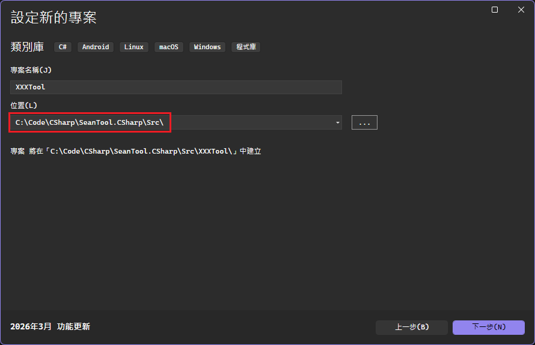
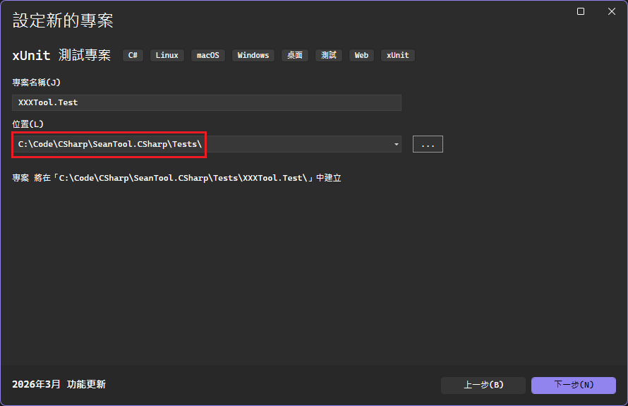
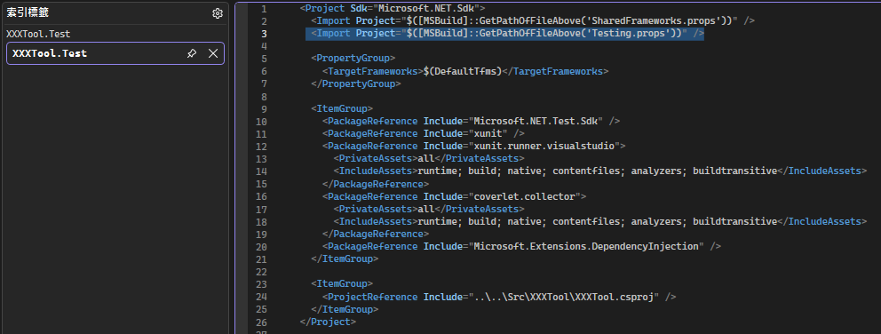
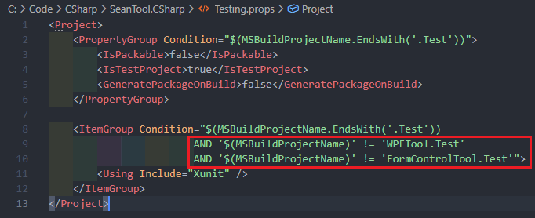
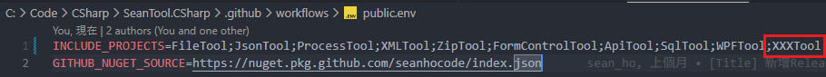
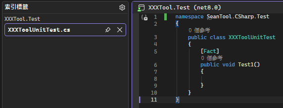

# 建立類別庫專案
1. 於``Src``資料夾中建立C#``類別庫``專案
    - 
    - 
    - 

2. 於該Tool專案的.csproj新增以下metadata設定
    ```csproj=
            <Import Project="$([MSBuild]::GetPathOfFileAbove('SharedFrameworks.props'))" />
            <Import Project="$([MSBuild]::GetPathOfFileAbove('Packaging.props'))" />

            <PropertyGroup>
                <TargetFrameworks>$(DefaultTfms)</TargetFrameworks>
                <PackageId>SeanTool.CSharp.XXXTool</PackageId>
                <Version>0.0.1</Version>
                <Description>XXXTool</Description>
                <PackageTags>tool;XXX;net8;net10</PackageTags>
            </PropertyGroup>
    ```
    - 
    - 如果是windows專案則
        - ``TargetFrameworks``改成``$(WindowsTfms)``
        - ``PropertyGroup``新增``<UseWindowsForms>true</UseWindowsForms>`` or ``<UseWPF>true</UseWPF>``

3. 於Tests資料夾中建立``xUnit測試專案``
    - 測試專案命名XXXTool.Test
    - 
    - 
    - 

4. 於該Test專案的.csproj新增以下metadata設定
    ```csproj=
            <Import Project="$([MSBuild]::GetPathOfFileAbove('SharedFrameworks.props'))" />
            <Import Project="$([MSBuild]::GetPathOfFileAbove('Testing.props'))" />

            <PropertyGroup>
                <TargetFrameworks>$(DefaultTfms)</TargetFrameworks>
            </PropertyGroup>

            <ItemGroup>
                <PackageReference Include="Microsoft.NET.Test.Sdk" />
                <PackageReference Include="xunit" />
                <PackageReference Include="xunit.runner.visualstudio">
                    <PrivateAssets>all</PrivateAssets>
                    <IncludeAssets>runtime; build; native; contentfiles; analyzers; buildtransitive</IncludeAssets>
                </PackageReference>
                <PackageReference Include="coverlet.collector">
                    <PrivateAssets>all</PrivateAssets>
                    <IncludeAssets>runtime; build; native; contentfiles; analyzers; buildtransitive</IncludeAssets>
                </PackageReference>
            </ItemGroup>

            <ItemGroup>
                <ProjectReference Include="..\..\Src\XXXTool\XXXTool.csproj" />
            </ItemGroup>
    ```
    - 
    - 如果是windows專案則
        - ``TargetFrameworks``改成``$(WindowsTfms)``
        - ``PropertyGroup``新增``<UseWindowsForms Condition="$(MSBuildProjectName.Contains('FormControl'))">true</UseWindowsForms>``
        - ``PropertyGroup``新增``<UseWPF Condition="$(MSBuildProjectName.Contains('WPF'))">true</UseWPF>``
    - 如果不用引用xUnit，在``Testing.props``的``ItemGroup Condition``忽略該專案
        - 

5. 設定自動部屬
    - 將新Tool名稱加入``.github\workflows\config.env``的``INCLUDE_PROJECTS``
    - 

6. 命名空間設定為``SeanTool.CSharp`` 、 ``SeanTool.CSharp.Test``
    - 
    - 