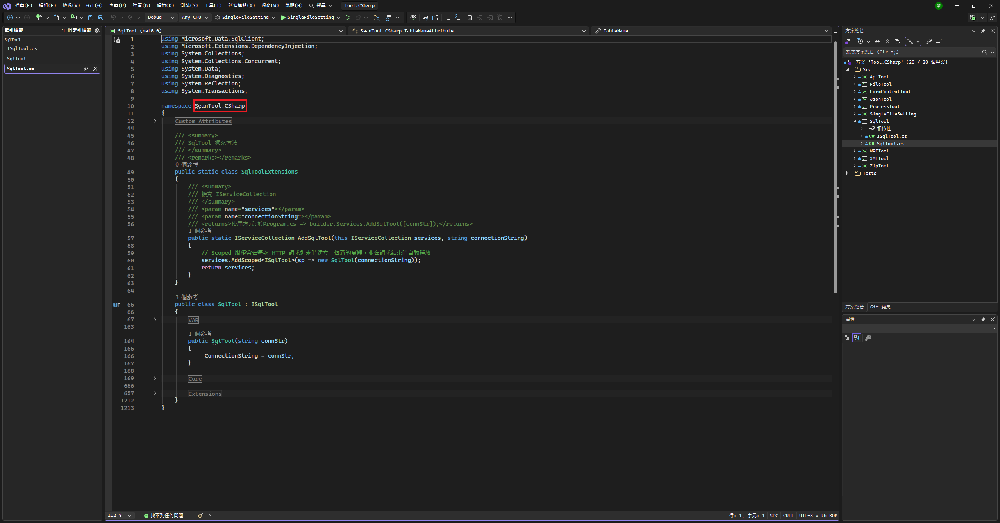

# 建立類別庫專案
1. 於``Src``資料夾中建立C#``類別庫``專案
    - 
    - 
2. 於Tests資料夾中建立``xUnit測試專案``
    - 測試專案命名XXXTool.Test
    - 
    - 
3. 於該Tool專案的.csproj新增以下metadata設定
    - 
    ```csproj=
        <!--修改--> 
        <TargetFrameworks>net8.0;net10.0</TargetFrameworks>
        <!--新增--> 
        <GeneratePackageOnBuild>true</GeneratePackageOnBuild>
        <PackageId>SeanTool.CSharp.[ToolName]</PackageId>
        <Version>[Version]</Version>
        <Authors>Sean Ho</Authors>
        <Description>[ToolName]</Description>
        <PackageTags>tool;zip;net8;net10</PackageTags>
        <PackageProjectUrl>https://github.com/seanhocode/Tool.CSharp</PackageProjectUrl>
        <RepositoryUrl>https://github.com/seanhocode/Tool.CSharp.git</RepositoryUrl>
        <RepositoryType>git</RepositoryType>
    ```
    - 
4. 設定自動部屬
    - 將新Tool名稱加入``.github\workflows\NugetPublish.yml``的``INCLUDE_PROJECTS``
    - 
5. 命名空間設定為``SeanTool.CSharp``
    - 