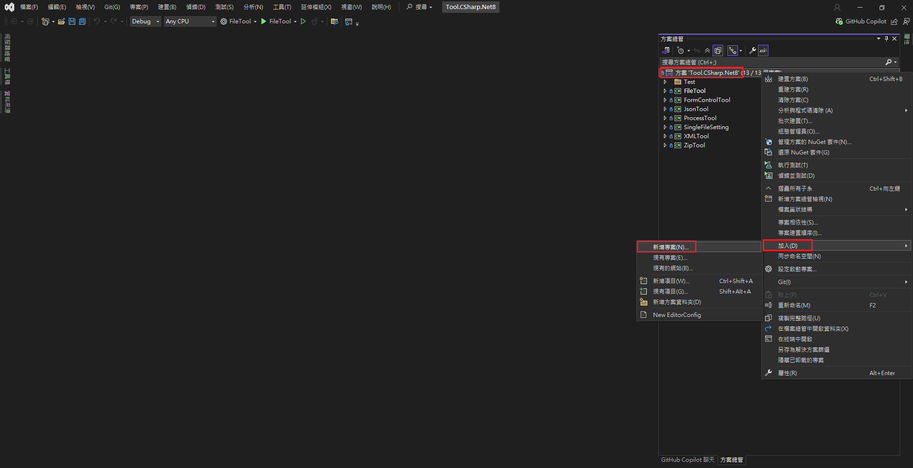
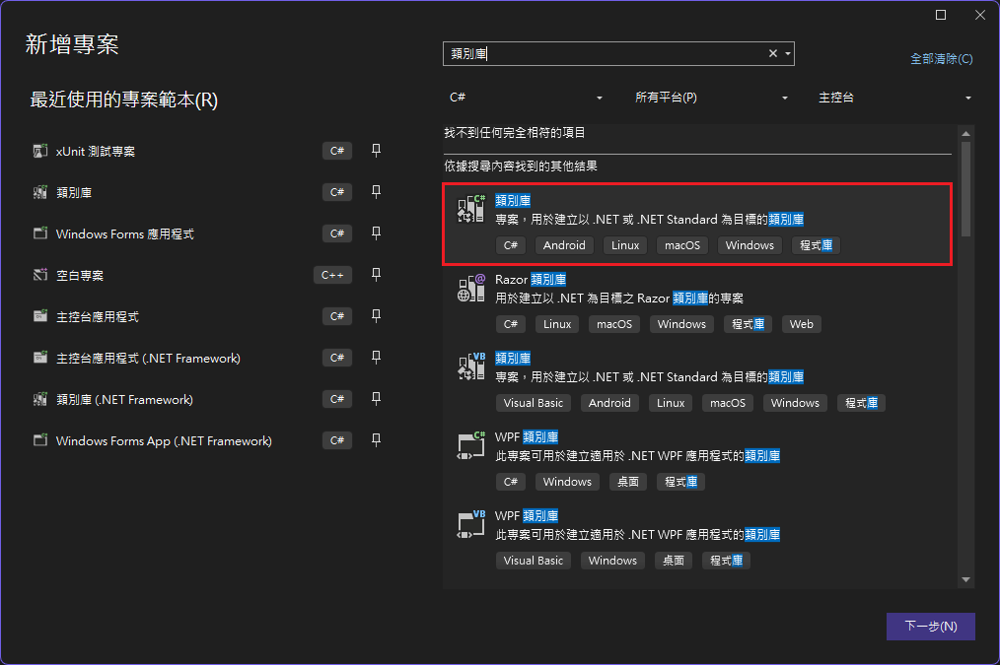
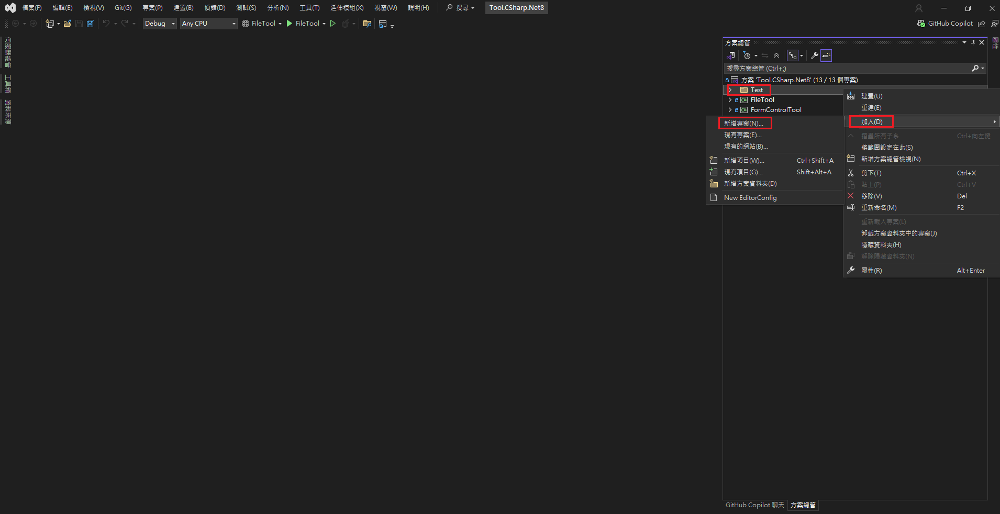
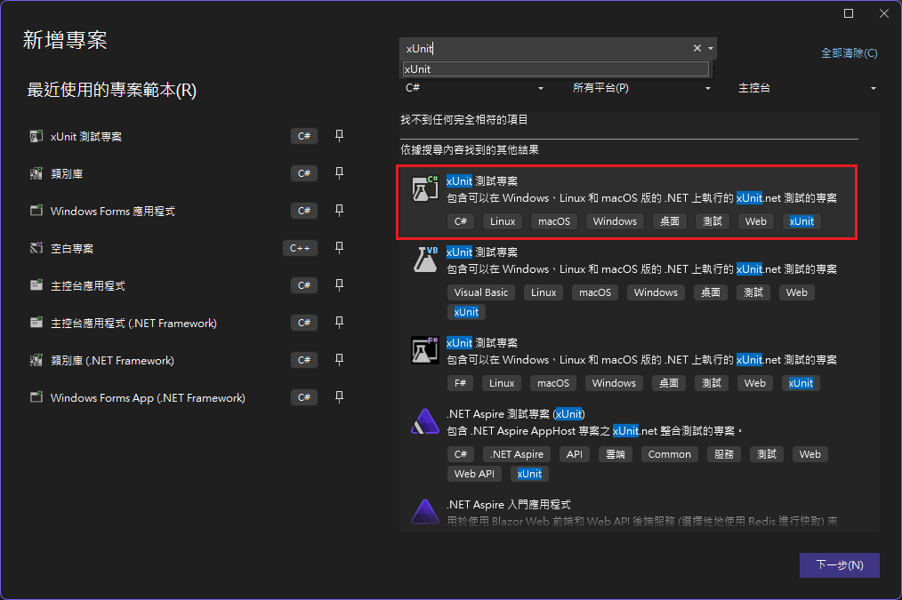
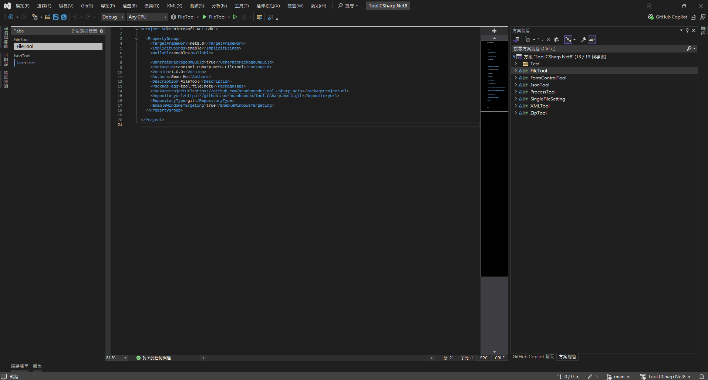
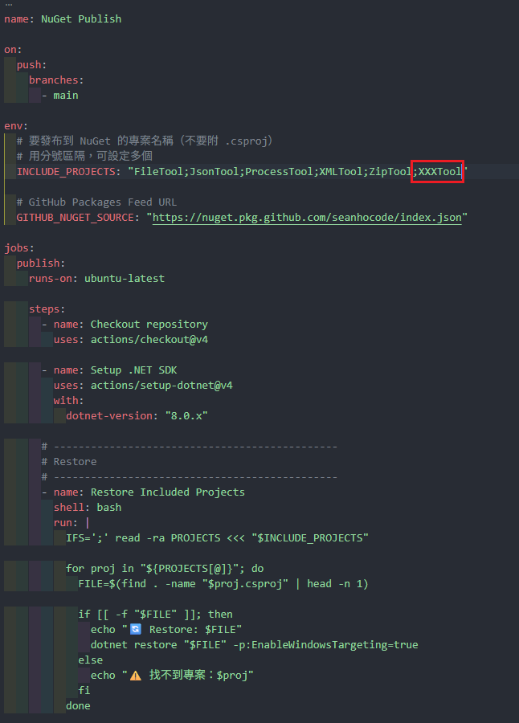

# 建立類別庫專案
1. 於主方案中建立C# .Net8``類別庫``專案
    - 
    - 
2. 於Test資料夾中建立``xUnit測試專案``
    - 測試專案命名XXXTool.Test
    - 
    - 
3. 於該Tool專案的.csproj新增以下設定
    - 
    ```csproj=
        <GeneratePackageOnBuild>true</GeneratePackageOnBuild>
        <PackageId>SeanTool.CSharp.Net8.XXXTool</PackageId>
        <Version>1.0.0</Version>
        <Authors>Sean Ho</Authors>
        <Description>XXXTool</Description>
        <PackageTags>tool;XXX;net8</PackageTags>
        <PackageProjectUrl>https://github.com/seanhocode/Tool.CSharp.Net8</PackageProjectUrl>
        <RepositoryUrl>https://github.com/seanhocode/Tool.CSharp.Net8.git</RepositoryUrl>
        <RepositoryType>git</RepositoryType>
        <EnableWindowsTargeting>true</EnableWindowsTargeting>
    ```
    - 
4. 設定自動部屬
    - 將新Tool名稱加入``.github\workflows\NugetPublish.yml``的``INCLUDE_PROJECTS``
    - 