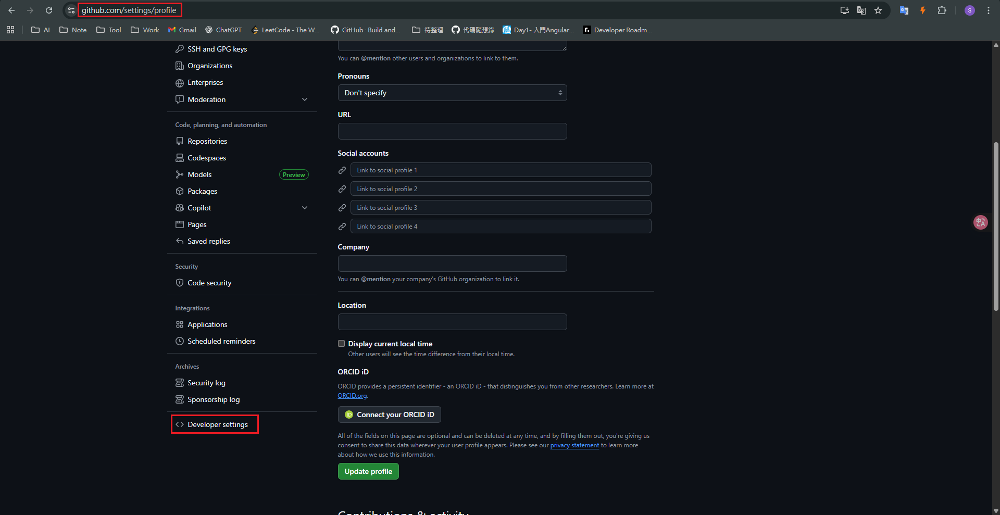
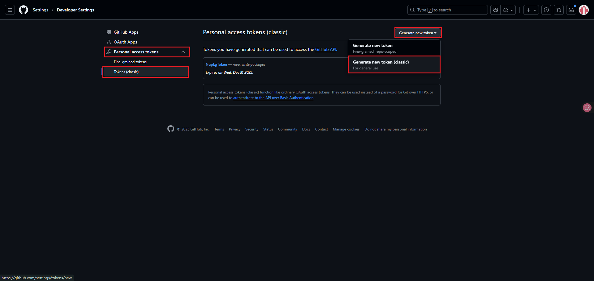
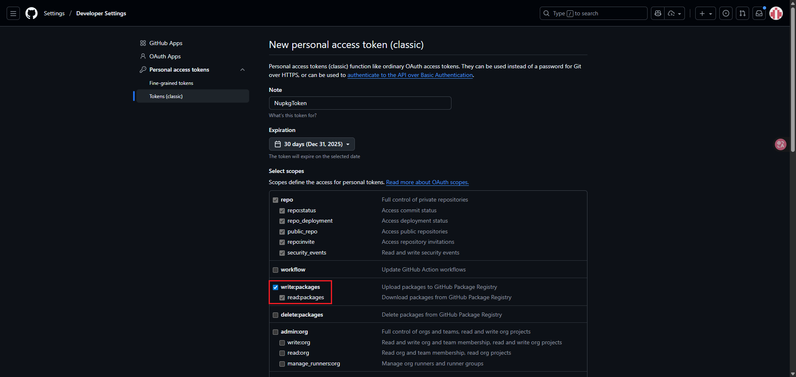
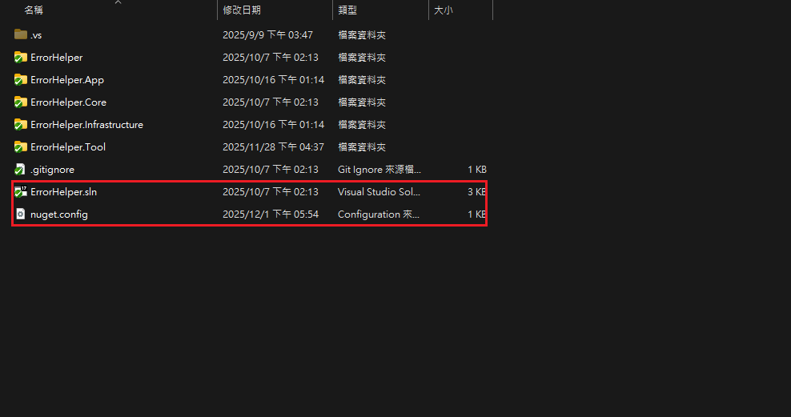
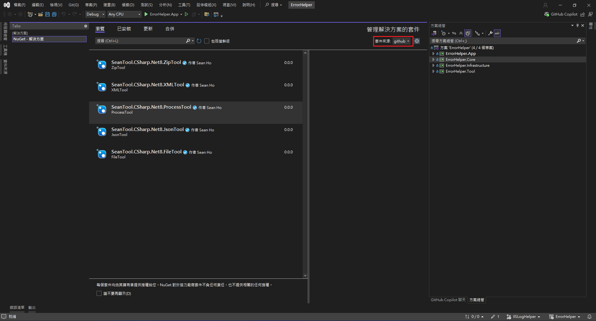
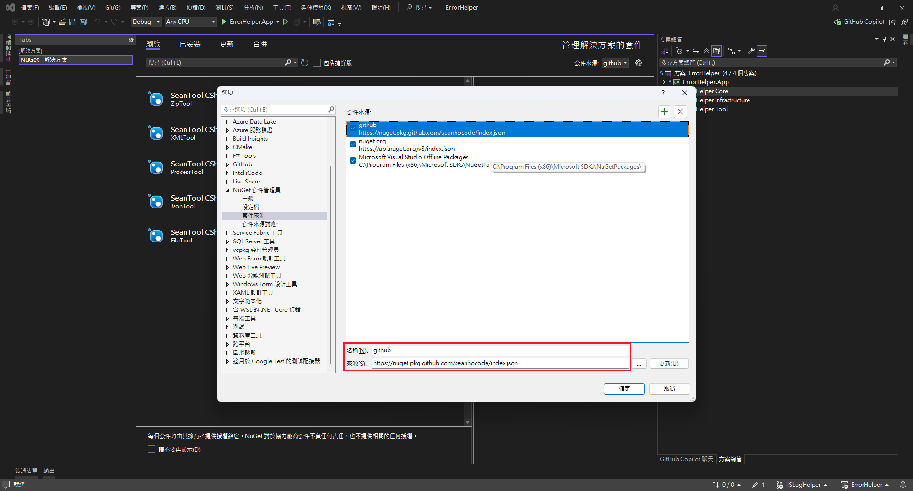

# 於其他專案使用打包好的Nuget Package
1. 生成個人存取權杖 (PAT)
    1. 進入 GitHub 網站的 ``Settings`` -> ``Developer settings`` -> ``Personal access tokens`` -> ``Tokens (classic)``
    2. 建立一個新的``Personal access tokens (classic)``
    3. 必須勾選以下權限：
        - write:packages (用於發布套件)
        - read:packages (用於下載套件)
    - 
    - 
    - 

2. 於新增``nuget.config``
    - 
    ```config=
    <?xml version="1.0" encoding="utf-8"?>
    <configuration>
        <packageSources>
            <add key="github" value="https://nuget.pkg.github.com/seanhocode/index.json" />
        </packageSources>

        <packageSourceCredentials>
            <github>
                <add key="Username" value="seanhocode" />
                <add key="ClearTextPassword" value="[YOUR_GITHUB_PAT]" />
            </github>
        </packageSourceCredentials>
    </configuration>
    ```
    - 
3. 於Nuget套件管理員安裝套件
    - 
    - 或手動設定(待確認)
    - 